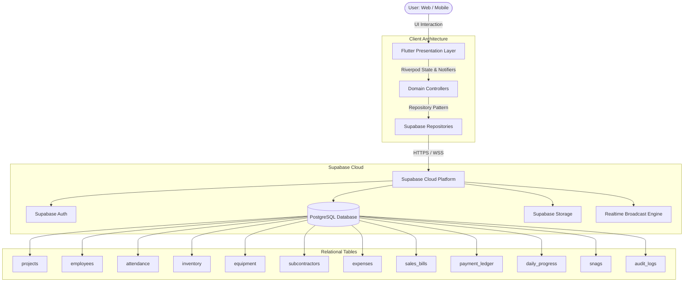

<div align="center">

# 🏗️ IBUILD ERP

### **Enterprise Construction Management & Site Operations ERP**

[](https://flutter.dev)
[](https://supabase.com)
[](https://ibuild.najibcode.workers.dev/#/login)
[](https://riverpod.dev)
[](https://products.office.com/excel)
[](https://pub.dev/packages/pdf)
[]()

*A robust, data-first Construction ERP built for business owners, project directors, site engineers, and accounting teams.*

[🌐 Live Web Application (Cloudflare Edge)](https://ibuild.najibcode.workers.dev/#/login) • [🗄️ Database Schemas & Migrations](docs/Database_Migrations.md)

---

</div>

## 📌 Executive Overview

**IBUILD ERP** is a full-featured, cross-platform construction management system designed to streamline real-time operations, workforce accountability, inventory logistics, quality control, and financial governance across construction project sites.

Built with **Flutter** (Web, Mobile, Desktop) and backed by **Supabase PostgreSQL with Row-Level Security (RLS)**, IBUILD replaces manual paperwork, disjointed spreadsheets, and WhatsApp trails with an integrated single source of truth.

---

## 🌟 Key Functional Modules

```
┌────────────────────────────────────────────────────────────────────────────────────────┐
│                                    IBUILD ERP SUITE                                    │
├──────────────────────┬──────────────────────┬───────────────────┬──────────────────────┤
│ 1. Project Portfolio │ 2. Workforce & Muster│ 3. Materials & SC │ 4. Financials & GST  │
├──────────────────────┼──────────────────────┼───────────────────┼──────────────────────┤
│ 5. Heavy Machinery   │ 6. Daily Logs (DPR)  │ 7. Quality Snags  │ 8. Audit Reports     │
└──────────────────────┴──────────────────────┴───────────────────┴──────────────────────┘
```

### 📊 1. Executive & Operational Dashboards
- **Role-Tailored Perspectives**: Dedicated dashboards for **Business Owners**, **Super Administrators**, and **Site Supervisors**.
- **Real-Time KPIs**: Live metrics tracking Active Projects, Workforce Present, Low-Stock Material Thresholds, and Expense Outflows.
- **Budget Utilization & Progress Gauge**: Dynamic visual tracking of allocated capital vs. actual spent against physical milestone completion.
- **Attention Required Engine**: Automated detection of low inventory, over-budget projects, and pending subcontractor retention.

---

### 🏗️ 2. Project Portfolio Management
- **Site Directory**: Comprehensive registry of commercial, residential, and infrastructure sites.
- **Budget & Cost Tracking**: Live budget variance tracking, physical progress metrics, and timeline baselines.
- **Submodule Operations Hub**: 8 itemized project operational submodules (Team, Materials, Machinery, Logs, Financials, Drawings, Snags, Reports).
- **Interactive Budget vs Actual**: Visual bar comparisons and overall health indices per site.

---

### 👷 3. Attendance & Muster Roll
- **Workforce Registry**: Directory of engineers, foremen, masons, carpenters, plumbers, and general laborers.
- **Daily Attendance Capture**: Fast morning/evening check-in/check-out with status tracking (*Present*, *Half-Day*, *Absent*, *Overtime*).
- **Wage & Allowance Engine**: Automated calculation of base daily wages and tea/snacks daily allowance (default ₹20/day).
- **Muster Roll Reports**: Date-filtered worker shifts and payroll summaries.

---

### 🧱 4. Materials & Supply Chain Management
- **Real-Time Stock Depots**: Track cement bags, structural steel (TMT), sand, gravel, and bricks.
- **Transaction Ledger**: Complete audit trail of stock movements (*RECEIVED*, *ISSUED*, *ADJUSTED*).
- **Low-Stock Automation**: Threshold-triggered alerts with automated reorder quantity recommendations.
- **Project-Linked Consumption**: Assign material dispatches directly to project sites to track material cost consumption.

---

### 💳 5. Financials & Billing Hub
- **Client Invoicing**: Build GST-compliant client invoices with itemized tax breakdowns (CGST + SGST or IGST).
- **Vendor & Supplier Bills**: Record purchasing vouchers, vendor invoices, and track outstanding payables.
- **Payment Ledger**: Real-time *Money In* / *Money Out* ledger with running account balance.
- **Statement of Accounts (SOA)**: 1-click generation of party-wise financial statements and GSTR-1 tax workbooks.
- **Instant WhatsApp Dispatch**: Share payment receipts and invoice summaries directly to clients via WhatsApp API.

---

### 🤝 6. Subcontractor & Trade Partner Management
- **Specialized Trade Directory**: Manage electrical, plumbing, HVAC, masonry, and painting contractors.
- **Contract & Retention Tracking**: Monitor total contract value, cumulative disbursements, and pending retention balances.
- **Work Order Milestones**: Track trade progress and milestone approvals before releasing stage payments.

---

### 🚜 7. Equipment, Machinery & Tools Fleet
- **Multi-Category Asset Directory**: Track heavy machinery (excavators, mixers), power tools, scaffolding, and generators.
- **Dynamic Asset Tracking**: Assign equipment to specific sites or freeform locations (*"Central Yard"*, *"Lorry Tool Box"*).
- **Maintenance & Condition Logs**: Log service records, operational health, and fuel consumption rates.

---

### 📋 8. Daily Progress Reports (DPR) & Site Logs
- **Daily Site Journal**: Log workforce counts, weather conditions, equipment deployed, and activities completed.
- **Site Photo Documentation**: Cloud-synced site progress photos with timestamps.
- **Site Delays & Obstacles**: Record delay reasons (*weather, material shortage, power outage*) for audit defense.

---

### 🔍 9. Quality Punch List & Snag Management
- **Snag Registry**: Log quality defects with location tags, severity (*Critical*, *High*, *Medium*, *Low*), and trade partner assignments.
- **Rectification Workflow**: Visual status pipeline (*Open* ➔ *In Progress* ➔ *Resolved* ➔ *Closed*).
- **Photo Evidence**: Before and after rectification photo attachments.

---

### 📈 10. Multi-Sheet Excel & Vector PDF Reporting
- **Consolidated ERP Excel Workbook**:
  - **Sheet 1: `Executive Summary`**: Title block, financial health, operational activity, and actionable alerts.
  - **Sheet 2: `Attendance`**: Individual worker attendance, hours, daily wages, allowances, and net payable.
  - **Sheet 3: `Materials`**: Stock transactions, unit rates, total valuation, and site dispatches.
  - **Sheet 4: `Subcontractors`**: Trade details, contract values, disbursements, and retention balances.
  - **Sheet 5: `Expenses`**: Direct site expenses, categories, payment modes, and voucher numbers.
  - **Sheet 6: `Payments`**: Payment ledger transactions, flow types, counterparties, and running balances.
  - *Data-First Architecture: 100% authoritative Supabase data, true numeric cell types (`DoubleCellValue`/`IntCellValue`), auto-fit columns, and zero mock data.*
- **Vector PDF Generator**: Executive audit reports with vector charts, financial summaries, and printable tables.

---

### ⚙️ 11. Admin Control Center & RBAC
- **4-Tab Super Admin Suite**:
  1. *System Overview & App Health* (live metrics, active sessions, table row counts)
  2. *User & Credentials Management* (assign roles: Owner, Admin, Supervisor, Viewer)
  3. *Security Audit Trail* (user login history and security events)
  4. *System Preferences & Branding*
- **Granular Permissions**: Role-based access control safeguarding sensitive financial, deletion, and export actions.

---

## 🛠️ Technology Stack

| Layer | Technology | Purpose |
| :--- | :--- | :--- |
| **Frontend Framework** | [Flutter 3.x](https://flutter.dev) | High-performance multiplatform Web, iOS & Android UI |
| **State Management** | [Flutter Riverpod](https://riverpod.dev) | Declarative, testable, and reactive state container |
| **Backend & Database** | [Supabase PostgreSQL](https://supabase.com) | Relational SQL database with strict Row-Level Security (RLS) |
| **Authentication** | Supabase Auth | Secure session management, password authentication, and JWT tokens |
| **Realtime Sync** | Supabase Realtime (WebSockets) | Live data synchronization across connected mobile and desktop clients |
| **Spreadsheet Engine** | [excel](https://pub.dev/packages/excel) | Native OpenXML `.xlsx` multi-sheet workbook generation |
| **PDF Engine** | [pdf](https://pub.dev/packages/pdf) & [printing](https://pub.dev/packages/printing) | High-resolution vector document synthesis and printing |
| **Charts & Analytics** | [fl_chart](https://pub.dev/packages/fl_chart) | Dynamic vector graphs, trends, and budget visualization |
| **Web Deployment** | [Vercel](https://vercel.com) | Optimized single-page application (SPA) edge hosting |

---

## 🏗️ System Architecture



---

## 📁 Repository Structure

```text
ibuild/
├── docs/                                # Architecture specs & migration documentation
│   ├── AI_Agent.md
│   ├── Database_Migrations.md
│   └── System_Architecture.md
├── lib/
│   ├── core/                            # Shared core utilities & foundational layer
│   │   ├── navigation/                  # Mobile navigation helpers & drawer controllers
│   │   ├── routing/                     # App router configurations
│   │   ├── services/                    # Excel, PDF, Push Notification services
│   │   ├── supabase/                    # Supabase client provider & realtime listeners
│   │   ├── theme/                       # Design tokens, color palettes, and typography
│   │   ├── utils/                       # Currency formatters, download helpers, WhatsApp API
│   │   └── widgets/                     # Web sidebar, header, search bars, paginated lists
│   ├── features/                        # Clean Architecture Feature Modules
│   │   ├── activities/                  # Activity logging & feeds
│   │   ├── admin/                       # Admin Control Center tabs & user management
│   │   ├── attendance/                  # Attendance tracking, wages & tea allowances
│   │   ├── auth/                        # Authentication, login & session persistence
│   │   ├── billing/                     # Invoices, vendor bills & Financials Hub
│   │   ├── daily_progress/              # DPR daily progress reports & site photos
│   │   ├── dashboard/                   # Role-specific executive & supervisor dashboards
│   │   ├── employees/                   # Staff directory & employee profile management
│   │   ├── equipment/                   # Heavy machinery, power tools & fleet assets
│   │   ├── expenses/                    # Site operational expense logging & categories
│   │   ├── inventory/                   # Material inventory & stock movements
│   │   ├── payments/                    # Payment ledger, money in/out & account balances
│   │   ├── profile/                     # User profile settings & notification preferences
│   │   ├── projects/                    # Site project portfolio & budget operations
│   │   ├── quotations/                  # Cost estimates & quotation builder
│   │   ├── rbac/                        # Role-based access control & permission guards
│   │   ├── reports/                     # Consolidated report generator (Excel & PDF)
│   │   ├── sales_bills/                 # Sales bills & tax invoice processing
│   │   ├── settings/                    # App settings & theme toggling
│   │   ├── snags/                       # Quality punch list & snag management
│   │   └── vendors/                     # Subcontractors & trade partner contracts
│   ├── main.dart                        # Application entry point & responsive root router
│   ├── mobile_dashboard.dart            # Mobile executive layout
│   └── web_dashboard.dart               # Desktop executive layout
├── supabase/
│   └── migrations/                      # Version-controlled SQL migration scripts
├── pubspec.yaml                         # Flutter dependencies & asset declarations
└── vercel.json                          # Vercel SPA configuration
```

---

## 🚀 Quick Start & Local Setup

### Prerequisites
- **Flutter SDK**: `^3.22.0` or higher ([Install Flutter](https://docs.flutter.dev/get-started/install))
- **Dart SDK**: `^3.4.0`
- **Supabase Account / Project Instance**

### Installation

1. **Clone the Repository**:
   ```bash
   git clone https://github.com/najibcode/ibuild.git
   cd ibuild
   ```

2. **Install Dependencies**:
   ```bash
   flutter pub get
   ```

3. **Configure Environment Variables**:
   Create a `.env` file in the root directory:
   ```env
   SUPABASE_URL=https://your-project.supabase.co
   SUPABASE_ANON_KEY=your-anon-key
   ```

4. **Run Application**:
   - **Web Development Server**:
     ```bash
     flutter run -d chrome
     ```
   - **Web Server (Headless/Network)**:
     ```bash
     flutter run -d web-server --web-port=8080
     ```
   - **Mobile Device / Emulator**:
     ```bash
     flutter run
     ```

5. **Static Analysis & Build Verification**:
   ```bash
   flutter analyze
   flutter build web --release
   ```

---

## 🗄️ Database Migrations

Database tables, constraints, and Row Level Security (RLS) policies are managed via SQL scripts in the `supabase/migrations/` folder.

Key migration files:
- `001_initial_schema.sql` — Core tables (`projects`, `employees`, `attendance`, `inventory`, `equipment`, `expenses`)
- `005_subcontractors.sql` — Trade partners, contracts, and retention tracking
- `008_billing_and_payments.sql` — Invoicing, vendor bills, and payment ledger
- `009_daily_progress_and_snags.sql` — Daily site journals, photos, and punch list snags
- `010_admin_control_center.sql` — Super-admin audit trail, system preferences, and user role management

---

## 🌐 Production Web Deployment (Cloudflare Workers)

The web client is deployed on **Cloudflare Workers** with Static Assets and global edge caching via `wrangler.jsonc`:

```jsonc
{
  "$schema": "node_modules/wrangler/config-schema.json",
  "name": "ibuild",
  "compatibility_date": "2026-08-17",
  "observability": {
    "enabled": true
  },
  "assets": {
    "directory": "build/web",
    "not_found_handling": "single-page-application"
  }
}
```

### Build & Deploy Commands:
```bash
# 1. Compile production Flutter web bundle
flutter build web --release

# 2. Deploy instantly to Cloudflare Edge CDN
npx wrangler deploy
```

Live Production URL: **[https://ibuild.najibcode.workers.dev/#/login](https://ibuild.najibcode.workers.dev/#/login)**

---

## 🛡️ Security & Access Governance

- **Row Level Security (RLS)**: Enforced on all PostgreSQL tables.
- **Role-Based Access Control (RBAC)**: Supported roles include `Owner`, `Admin`, `Supervisor`, and `Viewer`.
- **Audit Logging**: Sensitive operations (user management, invoice creation, status changes) trigger immutable entries in the audit trail.

---

## 📄 License

Copyright © 2026 **IBUILD**. All rights reserved.  
*Proprietary software engineered for internal construction management and operations.*
