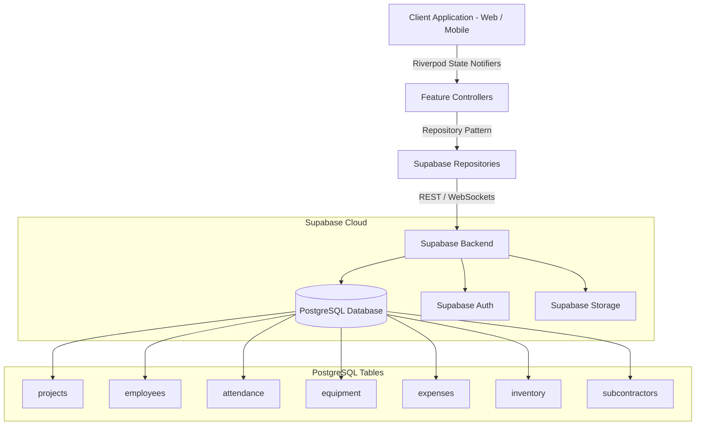

<div align="center">

# 🏗️ IBUILD ERP

**Internal Construction Management & Operations ERP**

[](https://flutter.dev)
[](https://supabase.com)
[](https://vercel.com)
[](https://riverpod.dev)
[]()

*A streamlined, high-performance Construction Management ERP built for site supervisors and business owners.*

[Live Web App](https://ibuild-najibcodes-projects.vercel.app) • [Vercel Dashboard](https://vercel.com/najibcodes-projects/ibuild) • [Database Migration Specs](docs/Database_Migrations.md)

---

</div>

## 📌 Executive Overview

**IBUILD ERP** is an internal, multi-platform construction management platform engineered to deliver real-time operational visibility over active construction sites. Built with **Flutter Web/Mobile** and **Supabase**, it replaces manual paperwork with structured site progress tracking, attendance, worker daily allowances, equipment management, and expense tracking.

> [!NOTE]  
> **IBUILD ERP** is tailored exclusively for internal operations by construction business owners and site supervisors, prioritizing speed, reliability on low-end mobile devices, and zero unnecessary operational overhead.

---

## ✨ Key Feature Modules

### 📊 1. Executive & Supervisor Dashboard
- **Real-Time Portfolio KPIs**: Track Active Projects, Workers Present, Low Stock Material Alerts, and Total Expense Outflows.
- **Budget Utilization Monitoring**: Interactive progress bars tracking percentage of overall capital spent against site baselines.
- **Site Velocity Chart**: Visual 7-day progress velocity charts built with `fl_chart`.
- **Live Activity Feed**: Real-time log of recent site logs, equipment transfers, and expense entries.

---

### 🏗️ 2. Project Management
- **Site Portfolio**: Comprehensive directory of ongoing and completed construction sites.
- **Budget Allocation**: Track allocated budget vs. actual outflows per site.
- **Phase Breakdowns**: Track structural milestone stages from foundation to finishing.
- **Dynamic Site Linking**: Auto-link materials, machinery, worker attendance, and expenses to specific project IDs.

---

### 👷 3. Employee & Attendance System
- **Employee Directory**: Manage site engineers, masons, carpenters, plumbers, and general labellers.
- **Tea & Daily Allowance Tracking**: Built-in calculation for daily tea and snacks allowance (default **₹20/day** per worker, stored separately from base wages to accommodate inflation adjustments).
- **Attendance Capture**: Fast morning/evening status capture with automated daily wage tallying.
- **Inline Employee Onboarding**: Quick "+ Add Employee" dialog to register new site staff instantly.

---

### 🛠️ 4. Equipment, Machinery & Tools Fleet
- **Multi-Category Fleet Management**: Track heavy machinery (excavators, concrete mixers), power tools (drilling machines), climbing gear (ladders, step stools), hand tools, and generators.
- **Searchable Autocomplete Locations**: Hybrid search dropdown allowing users to search existing site projects (e.g. typing `"RVS"`) or type freeform storage spots (e.g. *"Lorry Tool Box"*, *"Central Pool"*).
- **Usage & Maintenance Notes**: Log equipment condition, fuel consumption rates, and storage locations.

---

### 💰 5. Site Outflows & Expenses
- **Streamlined Expense Logger**: Record site operational costs, petty cash payouts, and supplier bills.
- **Category Filter Chips**: Single-tap filtering by category (*Labour*, *Materials*, *Transport*, *Equipment*, *Food*, *Fuel*, *Miscellaneous*).
- **Payment Mode Badges**: Track payment methods (*Cash*, *Bank Transfer*, *UPI*, *Cheque*).
- **Card-Level Quick Actions**: Instant Edit and Delete capabilities with popup confirmation dialogs.

---

### 🧱 6. Material Inventory
- **Live Stock Levels**: Track cement, steel reinforcement, sand, aggregate, and bricks.
- **Low Stock Warnings**: Automatic threshold alerts highlighting items requiring immediate restock.
- **Stock Movement Log**: Inward supply vs. site consumption tracking.

---

### 🤝 7. Subcontractor Management
- **Trade Directory**: Manage electrical, plumbing, painting, and carpentry subcontractors.
- **Contract Monitoring**: Active contract values, completed milestones, and pending disbursements.

---

### 👤 8. User Profile & RBAC Settings
- **Owner & Supervisor Profiles**: View and edit user details, phone, email, and company metadata.
- **Permission Guards**: Role-based access control (`PermissionGuard`) safeguarding sensitive financial operations.

---

## 🛠️ Technology Stack

| Layer | Technology | Purpose |
| :--- | :--- | :--- |
| **Frontend Framework** | [Flutter 3.x](https://flutter.dev) | Multiplatform Web, iOS & Android UI |
| **State Management** | [Flutter Riverpod](https://riverpod.dev) | Reactive, decoupled state controller architecture |
| **Database & Auth** | [Supabase PostgreSQL](https://supabase.com) | Relational database with Row Level Security (RLS) |
| **Cloud Storage** | Supabase Storage | Site progress photos & asset storage |
| **Charts & Data Viz** | [fl_chart](https://pub.dev/packages/fl_chart) | Responsive vector charts and trend graphs |
| **Web Hosting** | [Vercel](https://vercel.com) | Production Web SPA deployment |

---

## 🏗️ System Architecture



---

## 📁 Directory Structure

```text
ibuild/
├── docs/                      # Architectural specs & migration SQL
│   ├── AI_Agent.md
│   ├── Database_Migrations.md
│   └── System_Architecture.md
├── lib/
│   ├── core/                  # Design system, themes, & global widgets
│   │   ├── routing/           # GoRouter / router configurations
│   │   ├── supabase/          # Supabase client provider
│   │   ├── theme/             # AppColors & design tokens
│   │   └── widgets/           # Header, Sidebar, Navigation UI
│   ├── features/              # Feature modules (Clean Architecture)
│   │   ├── attendance/        # Attendance tracking & tea allowance
│   │   ├── auth/              # Authentication & login screens
│   │   ├── dashboard/         # Executive & supervisor dashboards
│   │   ├── employees/         # Employee directory & profile cards
│   │   ├── equipment/         # Fleet, tools, drill machines, & ladders
│   │   ├── expenses/          # Site outflows & payment logs
│   │   ├── inventory/         # Stock levels & restock alerts
│   │   ├── profile/           # User profile & business details
│   │   ├── projects/          # Site projects & budget baselines
│   │   ├── rbac/              # Role-based access permission guards
│   │   └── subcontractors/    # Trade partner contract tracking
│   ├── main.dart              # Application entry point
│   ├── mobile_dashboard.dart  # Mobile layout entry point
│   └── web_dashboard.dart     # Web layout entry point
├── pubspec.yaml               # Flutter package configuration
└── vercel.json                # Vercel SPA deployment configuration
```

---

## 🚀 Quick Start & Local Setup

### Prerequisites
- **Flutter SDK**: `^3.19.0` or higher ([Install Flutter](https://docs.flutter.dev/get-started/install))
- **Dart SDK**: `^3.3.0`
- **Supabase Account / Instance**

### Installation

1. **Clone the Repository**:
   ```bash
   git clone https://github.com/najibcode/ibuild.git
   cd ibuild
   ```

2. **Install Dependencies**:
   ```bash
   flutter pub get
   ```

3. **Configure Environment Variables**:
   Create a `.env` file in the root directory:
   ```env
   SUPABASE_URL=https://your-supabase-instance.supabase.co
   SUPABASE_ANON_KEY=your-supabase-anon-key
   ```

4. **Run Locally**:
   - **Run Web Server**:
     ```bash
     flutter run -d web-server
     ```
   - **Run Chrome**:
     ```bash
     flutter run -d chrome
     ```

---

## 🗄️ Database Migrations & Security

The database runs on **Supabase PostgreSQL** with strict **Row Level Security (RLS)** policies enabled. Full DDL schemas and migration scripts are available in [docs/Database_Migrations.md](docs/Database_Migrations.md).

Key tables include:
- `projects`: Project details, budget, timelines, and status.
- `employees`: Staff metadata, role, base wage rate, and `tea_snacks_allowance`.
- `attendance`: Daily morning/evening attendance records.
- `equipment`: Machinery & tools fleet details, tag number, site location, and notes.
- `expenses`: Financial outflows, payment mode, category, and remarks.

---

## 🌐 Web Deployment (Vercel)

The web client is configured for zero-configuration SPA deployments on **Vercel** via `vercel.json`:

```json
{
  "version": 2,
  "buildCommand": "flutter build web --release",
  "outputDirectory": "build/web",
  "cleanUrls": true,
  "rewrites": [
    { "source": "/(.*)", "destination": "/index.html" }
  ]
}
```

To build and deploy manually:
```bash
flutter build web --release
npx vercel --prod
```

---

## 🛡️ License

Copyright © 2026 IBUILD. All rights reserved. Proprietary software for internal construction management operations.
