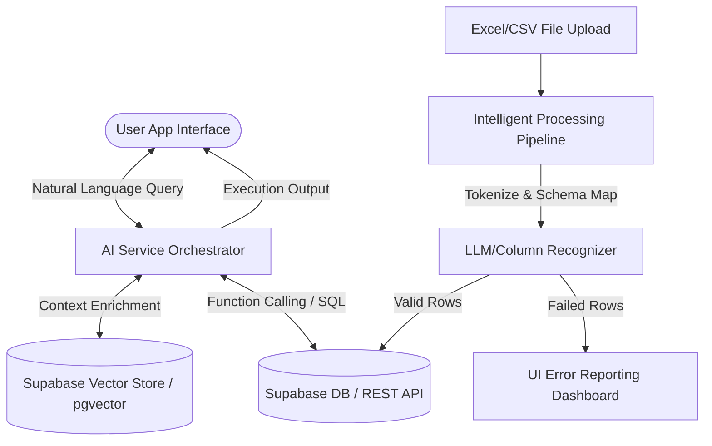

# Future AI Agent Integration Workflow

This document details the architectural layout, pipeline, and requirements for a future intelligent AI Assistant module within IBUILD ERP. 

---

## 1. System Architecture

The AI Agent acts as an intelligent layer interfacing between the user (web/mobile client) and the database (Supabase PostgreSQL, Vector Store, and Storage).



---

## 2. Structured Data Extraction (Excel Parsing Workflow)

The Excel ingestion pipeline leverages the AI agent to import unstructured spreadsheets and align them with the Database Schema.

### Pipeline Flow
1.  **File Upload**: The supervisor uploads an `.xlsx` or `.csv` file via the app.
2.  **Schema Alignment Phase**:
    *   The parsing agent inspects the file headers.
    *   It uses semantic embedding similarities to map columns (e.g., "Daily Wage", "Payout Rate", "Salary" are all mapped to `salary`).
3.  **Data Quality Validation**:
    *   Verify required constraints (e.g., `phone` format, non-negative `salary`, valid foreign key references).
4.  **Dry Run Execution**:
    *   Run imports in a transaction blocks. Highlight warnings for unrecognized rows or mismatched relations (e.g., trying to log attendance for an employee not listed in the directory).
5.  **Commit**: Insert records into Supabase and trigger dashboard updates.

---

## 3. Conversational AI Engine (Retrieval-Augmented Generation)

The natural language interface allows owners to query operational metrics without checking charts.

### Interface Workflows

```
User: "What was the total spent on cement last month at the Sunrise project?"
AI Agent:
  1. Identifies intent: Financial Query (Billing/Inventory/Expenses)
  2. Resolves parameters: 
     - project_name: "Sunrise"
     - category: "Materials"
     - material: "cement"
     - date_range: [2026-06-01, 2026-06-30]
  3. Executes postgres query via structured function calls.
  4. Returns: "At Sunrise Project, ₹1,42,000.00 was spent on Cement last month, covering 350 bags."
```

### Prompt Engineering Guidelines
*   **System Prompt Boundary**: Constrain the assistant to construction operational domains. Restrict access strictly based on the calling user's Supabase JWT roles.
*   **Context Ingestion**: Inject project budgets, active inventories, and daily supervisor logs into the LLM context frame for real-time accuracy.

---

## 4. Predictive Analytics Models

The AI agent will run scheduled analytics tasks to identify risks before they cause delays.

### A. Material Shortage Predictions
*   **Trigger**: Daily run.
*   **Input Data**:
    *   Current Stock Levels (`inventory` table).
    *   Daily Material Usage rates (`material_usage` log).
    *   Delivery Lead Times (`purchase_orders` historic logs).
*   **Model**: Simple regression analysis forecasting depletion thresholds.
*   **Alert Action**: Generate system alert if `current_stock - (average_daily_usage * lead_time) <= safety_threshold`.

### B. Project Delay Warnings
*   **Trigger**: On supervisor submitting `daily_progress`.
*   **Analysis Input**:
    *   Planned Completion Date vs. Current Date.
    *   Current Progress (`progress_percentage` field).
    *   Average daily progress delta over past 30 days.
*   **Formula**:
    $$\text{Remaining Days} = \frac{100 - \text{Current Progress}}{\text{Avg Daily Progress Delta}}$$
*   **Notification Action**: If $\text{Remaining Days} + \text{Current Date} > \text{Deadline}$, flag the project status as `delayed` and notify the owner.
