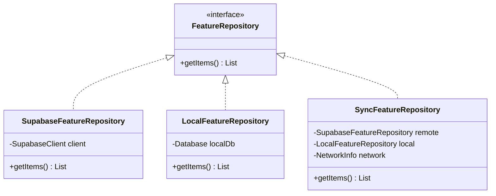

# Architecture Extensions & Scalability Report

This document reviews the current software architecture of IBUILD ERP and provides a blueprint for expanding the system to support Version 2.0 features without requiring code rewrites.

---

## 1. Current Architecture Review

IBUILD ERP uses a **Feature-First / Layered Architecture** hybrid structure. Each module resides in a self-contained feature directory, separated into `Data`, `Domain`, and `Presentation` layers:

*   **Data Layer**: Contains Entity Models (`fromJson`/`toJson`) and Supabase-backed concrete Repository implementations.
*   **Domain Layer**: Contains Abstract Repository Interfaces defining the contracts.
*   **Presentation Layer**: Contains Riverpod StateNotifier controllers and Screen/Form UI views.

### Architectural Strengths
1.  **Isolation**: Adding a feature (like `billing` or `expenses`) does not affect other features.
2.  **Explicit Data Contacts**: Domain repository interfaces abstract Supabase details away from the UI.
3.  **Low Rebuild Overhead**: Using fine-grained Riverpod `Provider` and `StateNotifierProvider` structures helps prevent global view rebuilds.

### Architectural Weaknesses & Technical Debt
1.  **Orphan Views in `lib/`**: There are 12 files at the root of `lib/` (e.g., `project_details_mobile.dart`, `web_dashboard.dart`, etc.) that bypass the clean feature-first folder structure. These files contain hardcoded mock flows and should be migrated to feature packages.
2.  **Navigation Coupling**: Mobile navigation relies on a custom enum `MobileScreen` and state-based page switching in `MainRouterScreen` (in `main.dart`). This prevents deep-linking, breaks web URL updates, and makes nested flows (like detail screens) difficult to maintain.
3.  **Lack of Dependency Injection abstraction**: Supabase is called directly through a single provider. For offline synchronization or local unit testing, a network service layer or caching repository decorator is missing.

---

## 2. Navigation Routing Migration Plan

To support web URL mapping, deep linking, and complex nested dashboards (such as portals), IBUILD ERP must migrate from the `MainRouterScreen` stack switch to **GoRouter Declarative Nested Routes** (ShellRoutes).

```
          [GoRouter Config]
                  │
          ┌───────┴───────┐
          ▼               ▼
    /login (Route)   /dashboard (ShellRoute)
                          │
         ┌────────┬───────┴────────┬────────┐
         ▼        ▼                ▼        ▼
       /home  /projects       /attendance /more
                  │                         │
                  ▼                         ▼
         /projects/:id (Sub-route)  ┌───────┼───────┐
                                    ▼       ▼       ▼
                                 /billing /expenses /settings
```

### Transition Steps (Backward Compatible)
1.  **Define Subroutes**: Migrate sub-views (like `ProjectMaterialsMobile` and `BudgetUtilizationMobile`) to child routes of `/projects/:id`.
2.  **Introduce StatefulShellRoute**: Use GoRouter's `StatefulShellRoute.indexedStack` inside `core/routing/router.dart` to preserve bottom navigation tab state across switches.
3.  **Deprecate `MainRouterScreen`**: Remove `MobileScreen` state modifications gradually, replacing `_pushMobile(screen)` calls with context-based routing, e.g., `context.go('/projects/$id')`.

---

## 3. Recommended Future Feature Directory Structure

Every new feature module added in Phase 2/3 must adhere to the standardized architecture layout:

```
lib/features/my_feature/
├── data/
│   ├── datasources/
│   │   ├── my_feature_remote_datasource.dart   # Raw Supabase client requests
│   │   └── my_feature_local_datasource.dart    # Offline SQLite/Hive caching
│   ├── models/
│   │   └── my_feature_model.dart               # Serialization & domain mapping
│   └── repositories/
│       └── my_feature_repository_impl.dart     # Concretely resolves local/remote datasources
├── domain/
│   ├── repositories/
│   │   └── my_feature_repository.dart          # Contract interfaces
│   └── usecases/                               # Optional: Separates complex business operations
│       └── process_my_transaction.dart
└── presentation/
    ├── controllers/
    │   └── my_feature_controller.dart          # Riverpod StateNotifier/Notifier
    ├── screens/
    │   ├── my_feature_list_screen.dart         # List page view
    │   └── my_feature_detail_screen.dart       # Item detail view
    └── widgets/
        └── my_feature_card.dart                # Local reusable UI component
```

---

## 4. Scalability Extension Points

### A. Offline-First Synchronization Extension
To prepare for Offline Sync, we will use a **Repository Cache Decorator Pattern**:



The app will read from the `SyncFeatureRepository` provider. If offline, the provider queries the local storage database and schedules a sync queue.

### B. Custom Portals and Role Expansion (RBAC)
To prevent mixing client, vendor, and manager logic, we split presentation flows:
*   **Core Logic Shares the Same Domain**: Both Owner app and Client/Vendor portal use the same `ProjectRepository`.
*   **Separate Presentation Layers**: Create distinct screen directories (e.g. `lib/features/projects/presentation/screens_portal/`) to isolate portal UI components from internal supervisor UIs, while sharing underlying Riverpod state controllers.
*   **Security at Database Level**: Secure access control at the database schema using Supabase RLS (Row Level Security), not app code.
