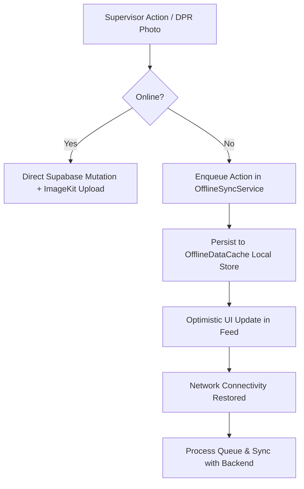

# Architecture Extensions & Scalability Report

This document details the software architecture, scalability mechanisms, offline synchronization pipeline, and database security design for **IBUILD ERP**.

---

## 1. Core Architecture Review

IBUILD ERP uses a **Feature-First / Layered Architecture** hybrid structure. Each module resides in a self-contained feature directory, separated into `Data`, `Domain`, and `Presentation` layers:

* **Data Layer**: Contains Entity Models (`fromJson`/`toJson`) and Supabase-backed concrete Repository implementations.
* **Domain Layer**: Contains Abstract Repository Interfaces defining the contracts.
* **Presentation Layer**: Contains Riverpod StateNotifier controllers and Screen/Form UI views.

---

## 2. Realtime Synchronization Architecture

The application establishes a consolidated Supabase Realtime channel `public:ibuild_sync` listening for postgres changes across all 13 active write tables:

```dart
_realtimeChannel = _supabase
    .channel('public:ibuild_sync')
    .onPostgresChanges(event: PostgresChangeEvent.all, schema: 'public', table: 'projects', callback: ...)
    .onPostgresChanges(event: PostgresChangeEvent.all, schema: 'public', table: 'expenses', callback: ...)
    .onPostgresChanges(event: PostgresChangeEvent.all, schema: 'public', table: 'attendance', callback: ...)
    .onPostgresChanges(event: PostgresChangeEvent.all, schema: 'public', table: 'daily_progress', callback: ...)
    .onPostgresChanges(event: PostgresChangeEvent.all, schema: 'public', table: 'employees', callback: ...)
    .onPostgresChanges(event: PostgresChangeEvent.all, schema: 'public', table: 'inventory', callback: ...)
    .onPostgresChanges(event: PostgresChangeEvent.all, schema: 'public', table: 'equipment', callback: ...)
    .onPostgresChanges(event: PostgresChangeEvent.all, schema: 'public', table: 'bills', callback: ...)
    .onPostgresChanges(event: PostgresChangeEvent.all, schema: 'public', table: 'payment_ledger', callback: ...)
    .onPostgresChanges(event: PostgresChangeEvent.all, schema: 'public', table: 'snags', callback: ...)
    .onPostgresChanges(event: PostgresChangeEvent.all, schema: 'public', table: 'profiles', callback: ...)
    .onPostgresChanges(event: PostgresChangeEvent.all, schema: 'public', table: 'checklist_items', callback: ...)
    .onPostgresChanges(event: PostgresChangeEvent.all, schema: 'public', table: 'project_checklists', callback: ...)
    .subscribe();
```

### Selective Invalidation
When an update event fires, only the affected Riverpod state notifiers are reloaded, eliminating unnecessary full-app redraws.

---

## 3. Offline Synchronization & Evidence Queue

To ensure uninterrupted site operations in remote basement or connectivity-deprived environments:


```mermaid
graph TD
    A[Supervisor Action / DPR Photo] --> B{Online?}
    B -- Yes --> C[Direct Supabase Mutation + ImageKit Upload]
    B -- No --> D[Enqueue Action in OfflineSyncService]
    D --> E[Persist to OfflineDataCache Local Store]
    E --> F[Optimistic UI Update in Feed]
    F --> G[Network Connectivity Restored]
    G --> H[Process Queue & Sync with Backend]
```

1. **`OfflineDataCache`**: Persists critical master datasets (employees, projects, attendance, snags) in local encrypted storage.
2. **`OfflineSyncService`**: Queues write actions (`snagCreate`, `snagUpdate`, `attendanceLog`) with exponential retry and deduplication.

---

## 4. Standardized Document Numbering & Anti-Fraud Architecture

All document-issuing modules (Vendor Bills, Client Invoices, and Quotations) share a unified `DocumentNumberGenerator`:

* **Bills (Operational Expenses)**: `BILL-YYYYMMDD-XXXX` (e.g., `BILL-20260803-7A3B`)
* **Sales Bills (Client Invoices)**: `INV-YYYYMMDD-XXXX` (e.g., `INV-20260803-5E1F`)
* **Quotations & Estimates**: `EST-YYYYMMDD-XXXX` (e.g., `EST-20260803-9C2D`)

### Authenticity Verification
The 4-character suffix (`XXXX`) is computed via a cryptographic checksum verifying document date and sequence integrity, preventing arbitrary forgery.
