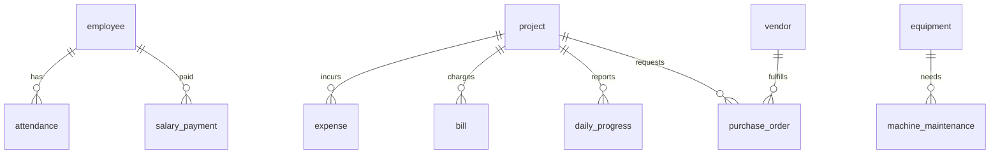

# Database Migration & Versioning Strategy

This document establishes the guidelines, naming standards, and extension mechanisms for modifying the Supabase PostgreSQL database during Future Phases.

---

## 1. Database Coding Standards & Naming Conventions

Consistency in the PostgreSQL database ensures that automatic code generators and future developers can trace schemas without confusion.

*   **Tables & Columns**: Always write names in lower_snake_case (e.g., `project_id`, `morning_image_url`). Use singular nouns for tables (e.g., `project`, `employee`, `attendance`, `bill`, `expense`).
*   **Foreign Keys**: Explicitly prefix with target table and `_id` suffix (e.g., `supervisor_id` referencing `profiles(id)`).
*   **Primary Keys**: Always use a unique identifier column named `id`. Recommend using `uuid` with `gen_random_uuid()` defaults for relational stability, or system-generated IDs where appropriate.
*   **Timestamps**: Every table must include `created_at` and `updated_at` columns, default-initialized with timezone:
    ```sql
    created_at TIMESTAMP WITH TIME ZONE DEFAULT timezone('utc'::text, now()) NOT NULL
    ```

---

## 2. Relational Extension Points (Designing for Change)

To introduce Version 2 features (like Vendor Portals, Equipment Tracking, Notifications, and Auditing) without breaking Version 1 tables, the schema incorporates the following extension patterns:

### A. Metadata JSONB Extensibility
To prevent constant schema updates for minor properties, every table must support a `metadata` column:
```sql
ALTER TABLE project ADD COLUMN metadata JSONB DEFAULT '{}'::jsonb NOT NULL;
```
This is useful for storing ad-hoc attributes like external integration keys, temporary OCR logs, or custom notifications settings.

### B. Soft Deletion Policy
Never run `DELETE` commands directly on primary entities (Projects, Employees). Instead, use a boolean flag:
```sql
ALTER TABLE employee ADD COLUMN is_deleted BOOLEAN DEFAULT false NOT NULL;
```
This preserves historical relations in `attendance`, `billing`, and `expenses` even if an employee is removed.

---

## 3. Recommended Schema Additions for Future Modules

The following SQL schemas define the extensions required for future modules. They are designed to hook into existing Version 1 tables seamlessly.



### A. Equipment & Machinery Tracking
```sql
CREATE TABLE equipment (
    id UUID PRIMARY KEY DEFAULT gen_random_uuid(),
    name VARCHAR(255) NOT NULL,
    model_number VARCHAR(100),
    serial_number VARCHAR(100) UNIQUE,
    purchase_date DATE,
    status VARCHAR(50) DEFAULT 'available' CHECK (status IN ('available', 'in_use', 'maintenance', 'retired')),
    current_project_id UUID REFERENCES projects(id) ON DELETE SET NULL,
    hourly_rate NUMERIC(10, 2) DEFAULT 0.00,
    created_at TIMESTAMP WITH TIME ZONE DEFAULT timezone('utc'::text, now()) NOT NULL,
    updated_at TIMESTAMP WITH TIME ZONE DEFAULT timezone('utc'::text, now()) NOT NULL
);

CREATE TABLE machine_maintenance (
    id UUID PRIMARY KEY DEFAULT gen_random_uuid(),
    equipment_id UUID REFERENCES equipment(id) ON DELETE CASCADE NOT NULL,
    maintenance_date DATE NOT NULL,
    description TEXT NOT NULL,
    cost NUMERIC(10, 2) NOT NULL,
    performed_by VARCHAR(255),
    next_due_date DATE,
    created_at TIMESTAMP WITH TIME ZONE DEFAULT timezone('utc'::text, now()) NOT NULL
);
```

### B. Purchase Orders & Vendor Portal
```sql
CREATE TABLE vendor (
    id UUID PRIMARY KEY DEFAULT gen_random_uuid(),
    company_name VARCHAR(255) NOT NULL,
    contact_person VARCHAR(100),
    phone VARCHAR(50),
    email VARCHAR(100) UNIQUE,
    gstin VARCHAR(15),
    address TEXT,
    created_at TIMESTAMP WITH TIME ZONE DEFAULT timezone('utc'::text, now()) NOT NULL
);

CREATE TABLE purchase_order (
    id UUID PRIMARY KEY DEFAULT gen_random_uuid(),
    po_number VARCHAR(50) UNIQUE NOT NULL,
    project_id UUID REFERENCES projects(id) ON DELETE RESTRICT NOT NULL,
    vendor_id UUID REFERENCES vendor(id) ON DELETE RESTRICT NOT NULL,
    order_date DATE NOT NULL,
    expected_delivery DATE,
    total_amount NUMERIC(12, 2) NOT NULL,
    status VARCHAR(50) DEFAULT 'draft' CHECK (status IN ('draft', 'pending_approval', 'approved', 'delivered', 'cancelled')),
    created_at TIMESTAMP WITH TIME ZONE DEFAULT timezone('utc'::text, now()) NOT NULL
);
```

### C. Salary & Payroll Automation
```sql
CREATE TABLE salary_payment (
    id UUID PRIMARY KEY DEFAULT gen_random_uuid(),
    employee_id UUID REFERENCES employees(id) ON DELETE RESTRICT NOT NULL,
    pay_period_start DATE NOT NULL,
    pay_period_end DATE NOT NULL,
    basic_salary NUMERIC(10, 2) NOT NULL,
    deductions NUMERIC(10, 2) DEFAULT 0.00,
    bonuses NUMERIC(10, 2) DEFAULT 0.00,
    net_payout NUMERIC(10, 2) GENERATED ALWAYS AS (basic_salary - deductions + bonuses) STORED,
    payment_date DATE NOT NULL,
    payment_mode VARCHAR(50) DEFAULT 'bank' CHECK (payment_mode IN ('cash', 'bank', 'upi', 'cheque')),
    status VARCHAR(50) DEFAULT 'paid' CHECK (status IN ('draft', 'processing', 'paid')),
    created_at TIMESTAMP WITH TIME ZONE DEFAULT timezone('utc'::text, now()) NOT NULL
);
```

### D. Audit Logging
```sql
CREATE TABLE audit_log (
    id UUID PRIMARY KEY DEFAULT gen_random_uuid(),
    user_id UUID REFERENCES auth.users(id) ON DELETE SET NULL,
    action_type VARCHAR(50) NOT NULL, -- INSERT, UPDATE, DELETE
    table_name VARCHAR(100) NOT NULL,
    record_id VARCHAR(100) NOT NULL,
    old_data JSONB,
    new_data JSONB,
    timestamp TIMESTAMP WITH TIME ZONE DEFAULT timezone('utc'::text, now()) NOT NULL
);
```

---

## 4. Migration Strategy & Rollback Plans

To run schema changes without downtime or data corruption, follow this workflow:

1.  **Local Schema Iteration**: Spin up a local Postgres environment using Supabase CLI (`supabase start`).
2.  **Generate Migration Scripts**: Create SQL files containing schema shifts (`supabase db diff --file add_equipment`).
3.  **Apply Migrations**: Test local migrations using `supabase db reset`.
4.  **Zero-Downtime Rule**: 
    *   Do not drop columns currently in use by Version 1 clients.
    *   Add new columns as `NULLABLE` first. Apply default values via background migrations, then alter constraint to `NOT NULL` in a subsequent release.
5.  **Rollback Plan**: For every migration script (e.g., `XXXX_up.sql`), write a companion rollback script (`XXXX_down.sql`).
    *   *Example Up*: `ALTER TABLE project ADD COLUMN is_archived BOOLEAN DEFAULT false;`
    *   *Example Down*: `ALTER TABLE project DROP COLUMN is_archived;`
