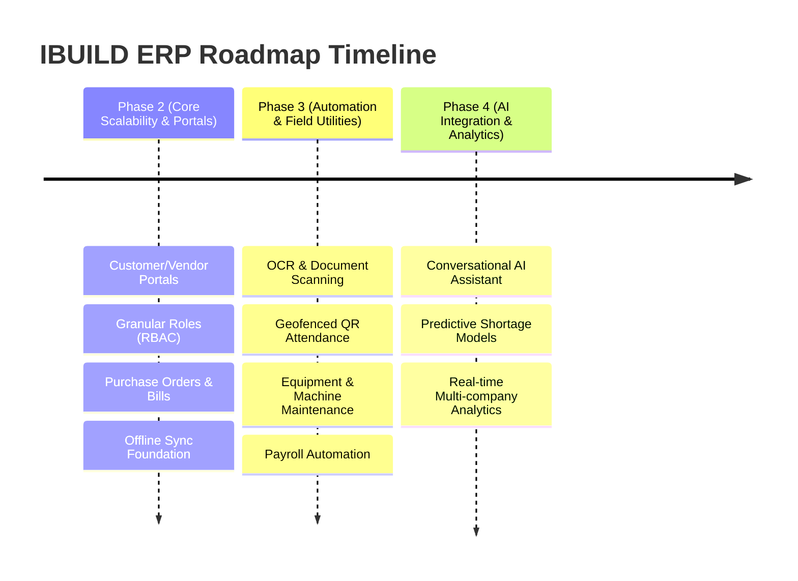

# IBUILD ERP — Future Roadmap (Version 2.0 & Beyond)

This document outlines the strategic product roadmap for IBUILD ERP. It documents planned features, expansion modules, and phase-wise timelines for future development iterations. 

---

## 1. Roadmap Overview & Philosophy

The guiding principle of the IBUILD ERP roadmap is **Stability First, Extensibility Always**. Version 1.0 establishes the foundation for operational tracking (Projects, Employees, Attendance, Inventory, Billing, and Expenses). Future versions will focus on automation, intelligent workflows (AI/OCR), external collaboration, and offline reliability.

---

## 2. Future Feature Catalog

The following features have been identified and scoped for future development phases. They are grouped by functional areas.

### A. Automation & Intelligent Workflows
*   **AI Assistant**: A natural language assistant for querying project health, predicting shortages, summarizing costs, and generating reports.
*   **OCR (Optical Character Recognition)**: Scanner to capture bills, invoices, and expense receipts directly from the device camera and auto-populate forms.
*   **Document Scanner**: High-resolution image capture and deskewing for paper contracts, vendor agreements, and delivery notes.
*   **Payroll Automation**: Automated calculation of employee payouts based on morning/evening attendance captures, overtime rates, and advance deductions.
*   **Excel Import/Export**: Batch import/export capability for high-volume entities (Employees, Attendance, Material Inventory, Bills, and Salaries).

### B. Access Control & Collaboration Platforms
*   **Customer Portal**: Restricted view for project clients to track milestones, view site progress photos, and monitor billing histories.
*   **Vendor Portal**: External workspace for suppliers to bid on material requests, submit digital invoices, and track outstanding payments.
*   **Role Expansion**: Granular Role-Based Access Control (RBAC) extending beyond Owner/Supervisor to include Roles like Project Manager, Procurement Officer, and Accountant.
*   **Audit Logs**: Comprehensive activity tracking logs detailing which user created, modified, or deleted any database record.
*   **Multi-Company Support**: Core support for parent-child organization structures, permitting an owner to manage multiple sub-contracting firms under a single portal.

### C. Site Operations & Field Utilities
*   **QR Attendance**: Localized tablet-based check-in using employee-specific QR cards.
*   **Face Recognition**: Biometric attendance verification at site gates to eliminate buddy-punching.
*   **Maps & Geofencing**: GPS-enabled attendance capture restricted to a project's physical boundaries.
*   **Equipment Tracking**: Management module for company-owned machinery, tracking allocations, fuel usage, and maintenance logs.
*   **Machine Maintenance**: Service logging, preventative breakdown alerts, and repair cost tracking for heavy equipment.

### D. Core Architecture Extensions
*   **Offline Synchronization**: Offline-first architecture allowing supervisors to log progress, attendance, and inventory shifts in remote areas with zero network connectivity.
*   **Real-time Collaboration**: WebSocket-based co-presence indicators, messaging, and push notifications for urgent site alerts.
*   **Advanced Analytics**: Custom dashboards featuring cost-benefit projections, earned value management (EVM), and labor productivity analysis.
*   **Voice Commands**: Hands-free field operations allowing supervisors to speak status reports ("Logged 50 bags of cement delivered").

---

## 3. Implementation Phases

To minimize architectural disruption and maintain system stability, the roadmap is divided into three execution phases.

### Phase 2: Core Scalability & Portals (Target: Q3-Q4)
*   **Primary Focus**: Relational extensions and collaboration.
*   **Deliverables**:
    *   Customer Portal & Vendor Portal (read-only views initially).
    *   Role Expansion (Procurement, Accountant).
    *   Standard Purchase Order workflow matching inventory transactions.
    *   Database-level audit logs for all entities.
    *   Basic offline persistence logic.

### Phase 3: Automation & Field Utilities (Target: Q1-Q2 Next Year)
*   **Primary Focus**: Operational velocity and field verification.
*   **Deliverables**:
    *   OCR Integration for bill scanning.
    *   GPS-geofenced QR Code Attendance.
    *   Equipment Tracking & Maintenance module.
    *   Payroll calculation engine.
    *   Excel data import/export workflows.

### Phase 4: AI & Advanced Intelligence (Target: Q3-Q4 Next Year)
*   **Primary Focus**: Predictive analytics and natural language interfaces.
*   **Deliverables**:
    *   AI Agent for reporting, analysis, and predictive material shortages.
    *   Biometric Face Recognition for attendance check-ins.
    *   Voice Command integration for hands-free field logging.
    *   Multi-company organization support.
