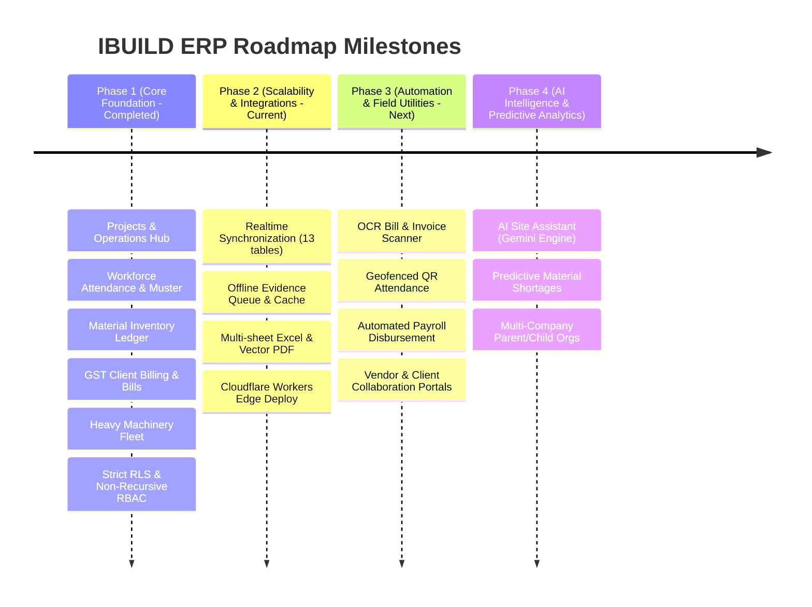

# IBUILD ERP — Future Roadmap & Milestone Plan

This document outlines the strategic product roadmap for IBUILD ERP, documenting completed deliverables and upcoming expansion modules.

---

## 1. Roadmap Overview & Philosophy

The guiding principle of the IBUILD ERP roadmap is **Stability First, Extensibility Always**. 

The core operational tracking system (Projects, Employees, Attendance, Inventory, Billing, Heavy Equipment, Defect Snagging, Daily Logs, and Strict RLS RBAC) is fully implemented and hardened in production. Future iterations focus on mobile biometric capture, OCR automation, external portal collaboration, and predictive analytics.

---

## 2. Milestone Execution Status

```mermaid
timeline
    title IBUILD ERP Roadmap Milestones
    Phase 1 (Core Foundation - Completed)
        : Projects & Operations Hub
        : Workforce Attendance & Muster
        : Material Inventory Ledger
        : GST Client Billing & Bills
        : Heavy Machinery Fleet
        : Strict RLS & Non-Recursive RBAC
    Phase 2 (Scalability & Integrations - Current)
        : Realtime Synchronization (13 tables)
        : Offline Evidence Queue & Cache
        : Multi-sheet Excel & Vector PDF
        : Cloudflare Workers Edge Deploy
    Phase 3 (Automation & Field Utilities - Next)
        : OCR Bill & Invoice Scanner
        : Geofenced QR Attendance
        : Automated Payroll Disbursement
        : Vendor & Client Collaboration Portals
    Phase 4 (AI Intelligence & Predictive Analytics)
        : AI Site Assistant (Gemini Engine)
        : Predictive Material Shortages
        : Multi-Company Parent/Child Orgs
```

---

## 3. Completed Modules (Production Ready)

- ✅ **Project Portfolio Management**: 8-submodule operations hub, budget variance metrics, and atomic trigger-based spend recalculation.
- ✅ **Workforce & Muster Roll**: Daily check-in/out, `daily_rate`/`salary` rate synchronization, tea allowance tracking, and historical wage snapshotting.
- ✅ **Materials & Supply Chain**: Multi-location stock depots, low-stock threshold alerts, and project consumption assignments.
- ✅ **Commercial Billing & Financials**: GST-compliant invoices (`INV-*`), vendor bills (`BILL-*`), quotations (`EST-*`), and party ledgers.
- ✅ **Heavy Machinery & Equipment**: Fleet directory, operational condition logs, and daily rental rates.
- ✅ **Daily Site Logs & Evidence**: DPR entries, photo attachments, architectural drawings, and defect snagging tickets.
- ✅ **Security & RBAC**: Strict PostgreSQL RLS policies isolating Employee accounts, non-recursive `SECURITY DEFINER` role resolvers, and compact JWT tokens (< 8 KB).
- ✅ **Exports & Reporting**: Multi-sheet Excel workbooks (`.xlsx`) and vector PDF reports.
- ✅ **Cloudflare Edge Deployment**: Web client hosted on Cloudflare Workers Static Assets with global caching.

---

## 4. Upcoming Expansion Catalog

### A. Automation & Field Utilities (Target: Q3-Q4)
* **OCR Receipt Scanner**: Instant camera capture and OCR parsing of vendor bills and delivery challans.
* **Geofenced QR Code Check-in**: Mobile tablet attendance kiosks restricted to physical site coordinates.
* **Automated Payroll Engine**: 1-click batch generation of worker wage payouts factoring in attendance records, overtime, and advances.

### B. Collaboration Portals & Multi-Company (Target: Q1 Next Year)
* **Client Portal**: Dedicated read-only milestone tracking and progress photo feed for property buyers and clients.
* **Vendor Portal**: Supplier self-service portal for submitting digital bids and viewing payment ledger balances.
* **Multi-Company Architecture**: Parent-organization tenant isolation for contractors operating multiple corporate entities.

### C. AI Site Assistant & Analytics (Target: Q2 Next Year)
* **Conversational AI Agent**: Natural language query engine for project health, cost variance forecasting, and milestone analysis.
* **Predictive Material Shortage**: Machine learning alerts predicting cement and steel stockouts based on DPR consumption velocity.
